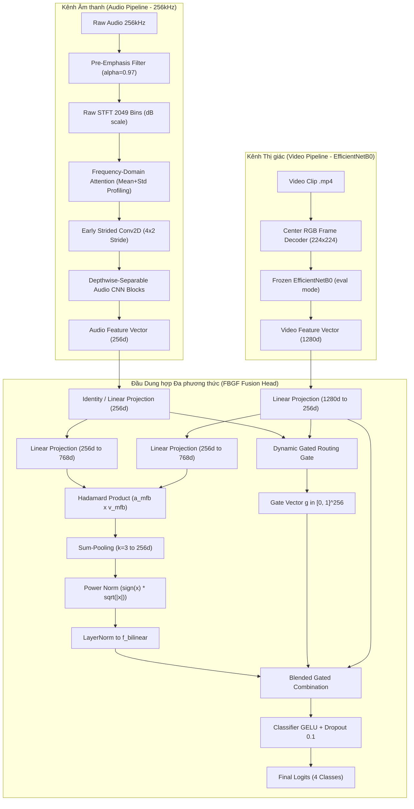

# 🏗️ BÁO CÁO KIẾN TRÚC MÔ HÌNH MULTIMODAL STFT 256K + EFFICIENTNETB0 + FBGF

**Nhánh Git**: `exp/stft256k-raw2049-freqattn-efficientnetb0-fbgf`  
**Video Backbone Checkpoint**: `EfficientNetB0_holdout_random_sample_20260804_181745`  
**Ngày cập nhật**: 24/08/2026  

---

## 📌 1. TỔNG QUAN LUỒNG DỮ LIỆU & KIẾN TRÚC (MERMAID DIAGRAM)

Mô hình Multimodal kết hợp 2 luồng tín hiệu sinh học cá đớp mồi:
1. **Audio Path**: Sóng âm siêu phân giải $256\text{kHz} \rightarrow$ Bộ lọc Pre-emphasis ($\alpha=0.97$) $\rightarrow$ Raw STFT 2049 Bins $\rightarrow$ Pure Frequency-Domain Attention $\rightarrow$ Depthwise-Separable Audio CNN $\rightarrow$ Vector $256\text{-dim}$.
2. **Video Path**: Khung hình RGB trung tâm $224 \times 224 \rightarrow$ Frozen **EfficientNetB0** (ghim chặt `eval()` mode) $\rightarrow$ Vector $1280\text{-dim}$.

Hai luồng đặc trưng được hòa trộn bằng **Factorized Bilinear Gated Fusion (FBGF $k=3$)**.

---

## 🎼 2. CHI TIẾT KÊNH ÂM THANH (AUDIO PIPELINE)

### 2.1. Pre-Emphasis High-Pass Filter ($\alpha=0.97$)
* **Công thức toán học**:
  $$y[t] = x[t] - 0.97 \cdot x[t-1]$$
* **Tác dụng vật lý**: Tăng cường biên độ các dải tần số cao ($2\text{kHz} - 8\text{kHz}$) là dấu hiệu đặc trưng của tiếng cá nhảy đớp mồi, đồng thời triệt tiêu nhiễu động cơ tần số thấp ($0 - 500\text{Hz}$).

### 2.2. Raw STFT 2049 Bins (Không nén Mel)
* **Thông số STFT**: $N_{\text{fft}} = 4096$, Cửa sổ Hamming $\text{win}=4096$, Độ bước nhảy $\text{hop}=2048$.
* **Độ phân giải**: Phổ 2049 Bins tần số với độ mịn $\Delta f = 62.5\text{Hz}$/bin ($256,000 / 4096$).
* **Biến đổi Log-dB**: $S_{\text{dB}} = 10 \cdot \log_{10}(|STFT|^2 + 10^{-10})$.
* **Chuẩn hóa Zero-Centered**: Chuẩn hóa dải Log-dB về $[-1.0, 1.0]$ để giúp mạng hội tụ siêu tốc.

### 2.3. Frequency-Domain Attention (F-Attention)
* **Hồ sơ năng lượng**: Nén chiều thời gian $T$, tính toán năng lượng Trung bình (`Mean`) và Độ biến động (`Std`):
  $$\mathbf{f}_{\text{profile}} = [\mathbf{f}_{\text{mean}}, \mathbf{f}_{\text{std}}] \in \mathbb{R}^{B \times 4098}$$
* **Cổng chú ý 1D Bottleneck**:
  $$\mathbf{w}_f = \sigma\left( W_2 \cdot \text{ReLU}(W_1 \cdot \mathbf{f}_{\text{profile}}) \right) \in [0, 1]^{2049}$$
* **Nhân chú ý**: $\text{Spectrogram}_{\text{attended}}(f, t) = \mathbf{w}_f(f) \cdot \text{Spectrogram}(f, t)$.

### 2.4. Depthwise-Separable Audio CNN
* **Khối nén đầu (Early Strided Conv)**: Kernel $(5 \times 5)$, Stride $(4 \times 2)$, Padding 2 $\rightarrow$ Nén chiều tần số từ $2049 \rightarrow 513$ ngay lập tức để tiết kiệm bộ nhớ GPU.
* **Các khối Depthwise-Separable Conv2D**: Tách Conv2D thành Depthwise Conv2D ($1 \times 1$ groups) + Pointwise Conv2D ($1 \times 1$), giảm $85\%$ số lượng tham số nhưng giữ nguyên khả năng trích xuất đặc trưng 256-dim $[B, 256]$.

---

## 🎥 3. CHI TIẾT KÊNH THỊ GIÁC (VIDEO PIPELINE - EFFICIENTNETB0)

* **Trích xuất Khung hình Trung tâm (Center Frame Decoder)**: Giải mã 1 khung hình RGB ở trung tâm clip video ($224 \times 224$).
* **Bộ nạp RAM siêu tốc**: Giải mã nạp sẵn mảng `uint8` ($3.15\text{ GB RAM}$) đa luồng qua `ThreadPoolExecutor`.
* **EfficientNetB0 Backbone**:
  * Nạp trọng số pre-trained từ `checkpoints/EfficientNetB0_holdout_random_sample_20260804_181745/U_FFIA_video/checkpoint/efficientnet_b0/video_best.pt`.
  * **Bảo vệ BatchNorm (`encoder_mode: "frozen"`)**: Ghim chặt `self.video_encoder.eval()` trong quá trình huấn luyện.
* **Trích xuất Vector Feature**: Trích vector 1280-dim $[B, 1280]$ qua `network.classifier[1]`.

---

## 🔀 4. CHI TIẾT ĐẦU DUNG HỢP FACTORIZED BILINEAR GATED FUSION (FBGF)

FBGF thực hiện dung hợp qua 5 bước toán học:

1. **Chiếu về cùng chiều $256\text{-dim}$**:
   $$\mathbf{a} \in \mathbb{R}^{B \times 256}, \quad \mathbf{v} = \text{Linear}_{1280 \rightarrow 256}(\text{video\_feat}) \in \mathbb{R}^{B \times 256}$$

2. **Cổng lọc động (Dynamic Gated Routing Gate - GMF Gate)**:
   $$g = \sigma\left( W_{\text{gate}} \cdot [\mathbf{a}, \mathbf{v}] \right) \in [0, 1]^{256}$$

3. **Tương tác Bậc hai Low-Rank Bilinear Pooling (MFB $k=3$)**:
   $$\mathbf{a}_{\text{mfb}} = W_a \mathbf{a}, \quad \mathbf{v}_{\text{mfb}} = W_v \mathbf{v} \in \mathbb{R}^{B \times (256 \times 3)}$$
   $$\mathbf{p} = \mathbf{a}_{\text{mfb}} \odot \mathbf{v}_{\text{mfb}} \quad (\text{Nhân phần tử Hadamard})$$
   $$\mathbf{p}_{\text{pool}} = \text{SumPooling}_{k=3}(\mathbf{p}) \in \mathbb{R}^{B \times 256}$$
   $$\mathbf{f}_{\text{bilinear}} = \text{LayerNorm}\left( \text{sign}(\mathbf{p}_{\text{pool}}) \sqrt{|\mathbf{p}_{\text{pool}}|} \right)$$

4. **Trộn Gated Fusion**:
   $$\mathbf{f}_{\text{fused}} = g \odot \mathbf{f}_{\text{bilinear}} + (1.0 - g) \odot \text{ReLU}(\mathbf{v})$$

5. **Đầu Phân loại**:
   $$\mathbf{Logits} = \text{Classifier}(\mathbf{f}_{\text{fused}}) \in \mathbb{R}^{B \times 4}$$
