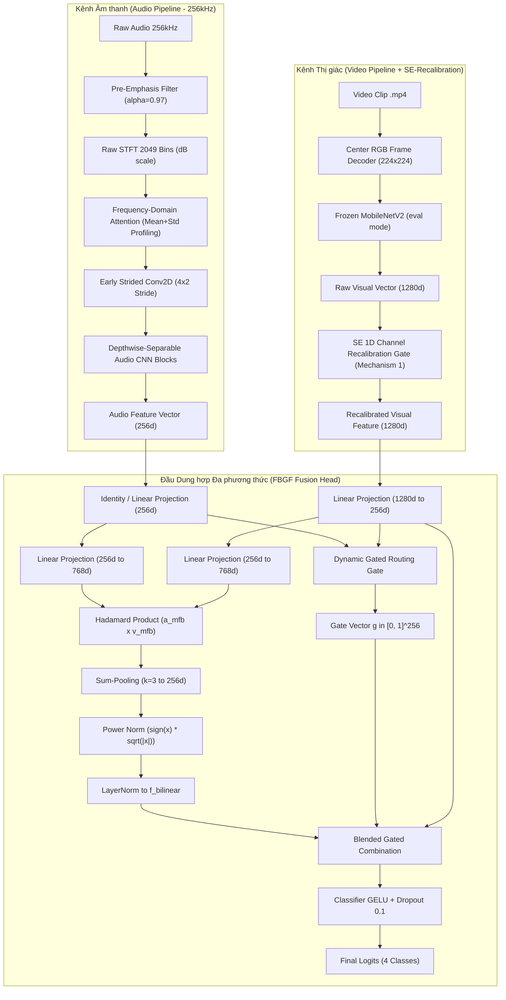

# 🏗️ BÁO CÁO KIẾN TRÚC MÔ HÌNH MULTIMODAL STFT 256K + MOBILENETV2 (SE 1D RECALIBRATION) + FBGF

**Nhánh Git**: `exp/stft256k-raw2049-freqattn-mobilenetv2-se-fbgf`  
**Cơ chế bổ sung cho Video**: **Mechanism 1 - Squeeze-and-Excitation 1D Channel Recalibration (`SERecalibration1D`)**  
**Ngày cập nhật**: 24/08/2026  

---

## 📌 1. TỔNG QUAN LUỒNG DỮ LIỆU & KIẾN TRÚC (MERMAID DIAGRAM)

Mô hình Multimodal kết hợp 2 luồng tín hiệu sinh học cá đớp mồi:
1. **Audio Path**: Sóng âm siêu phân giải $256\text{kHz} \rightarrow$ Bộ lọc Pre-emphasis ($\alpha=0.97$) $\rightarrow$ Raw STFT 2049 Bins $\rightarrow$ Pure Frequency-Domain Attention $\rightarrow$ Depthwise-Separable Audio CNN $\rightarrow$ Vector $256\text{-dim}$.
2. **Video Path with SE-Recalibration**: Khung hình RGB trung tâm $224 \times 224 \rightarrow$ Frozen MobileNetV2 $\rightarrow$ Vector $1280\text{-dim} \rightarrow$ **SE 1D Channel Recalibration (Mechanism 1)** $\rightarrow$ Vector $1280\text{-dim}$ đã được tái hiệu chỉnh trọng số dải kênh.

Hai luồng đặc trưng được hòa trộn bằng **Factorized Bilinear Gated Fusion (FBGF $k=3$)**.

---

## 🎥 2. CHI TIẾT CƠ CHẾ MECH 1 (SE 1D CHANNEL RECALIBRATION FOR VIDEO)

### Công thức Toán học:
$$\mathbf{v}_{\text{raw}} \in \mathbb{R}^{B \times 1280}$$
$$\mathbf{w}_{\text{channel}} = \sigma\left( W_2 \cdot \text{ReLU}(W_1 \mathbf{v}_{\text{raw}}) \right) \in [0, 1]^{1280}$$
$$\mathbf{v}_{\text{recalibrated}} = \mathbf{v}_{\text{raw}} \odot \mathbf{w}_{\text{channel}}$$

### Tác dụng Kỹ thuật:
* Tự động điều chỉnh tầm quan trọng của từng dải kênh đặc trưng 1280-dim trước khi thu nén về 256-dim.
* Giúp khuếch đại các kênh nhạy cảm với hình ảnh bọt nước nhảy và bóng chuyển động của cá, dập nén các kênh mang nhiễu nền nước tĩnh.
