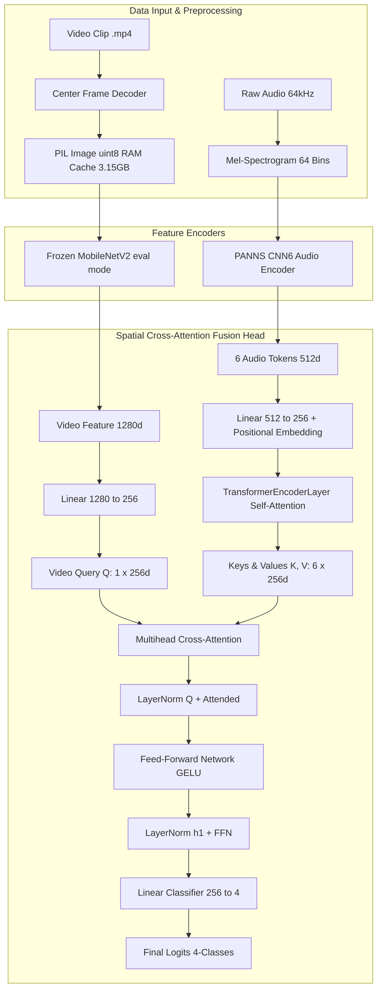

# 🏗️ BÁO CÁO KIẾN TRÚC MÔ HÌNH SPATIAL CROSS-ATTENTION (PANNS CNN6 + MOBILENETV2)

**Nhánh Git**: `exp/midframe-to-audio-cross-attn`  
**Ngày cập nhật**: 23/08/2026  

---

## 📌 1. TỔNG QUAN HỆ THỐNG

Mô hình Multimodal kết hợp hai nguồn tín hiệu sinh học cá đớp mồi:
1. **Tín hiệu Âm thanh (Audio)**: 6 Tokens đặc trưng âm thanh $[B, 6, 512]$ trích xuất từ mô hình PANNS CNN6 ($64\text{kHz}$ Mel-Spectrogram).
2. **Tín hiệu Thị giác (Video)**: Khung hình RGB trung tâm được mã hóa qua mô hình **MobileNetV2** ($92\%$ baseline accuracy) thành vector 1280-dim $[B, 1280]$.

Hai luồng đặc trưng được dung hợp qua khối **Spatial Cross-Attention** (`CrossAttentionHead`).



---

## ⚙️ 2. HƯỚNG DẪN CẤU HÌNH TRONG `src/config/train_config.json`

Toàn bộ mô hình có thể tùy chỉnh linh hoạt qua file `src/config/train_config.json`:

```json
{
  "references": {
    "audio_repo": "../U_FFIA27K_audio",
    "video_repo": "../U_FFIA27K_video"
  },
  "checkpoints": {
    "audio": "../checkpoints/PANNS_Cnn6_holdout_random_sample_20260729_153012/DL_audio/checkpoint/panns_cnn6/audio_best.pt",
    "video_by_backbone": {
      "mobilenet_v2": "../checkpoints/MobileNetV2_holdout_random_sample_20260729_153012/DL_video/checkpoint/mobilenet_v2/video_best.pt"
    }
  },
  "data": {
    "split_dir": "../checkpoints/PANNS_Cnn6_holdout_random_sample_20260729_153012/DL_audio/checkpoint/panns_cnn6/splits",
    "cache_audio": false,
    "video_cache_mode": "ram",
    "num_workers": -1,
    "image_size": 224
  },
  "model": {
    "video_backbone": "mobilenet_v2",
    "encoder_mode": "frozen",
    "d_model": 256,
    "num_heads": 4,
    "dropout": 0.1
  },
  "training": {
    "batch_size": 64,
    "epochs": 100,
    "fusion_learning_rate": 0.001,
    "encoder_learning_rate": 0.001,
    "weight_decay": 0.0001,
    "seed": 42,
    "device": "auto",
    "output_dir": "checkpoint"
  },
  "results_upload": {
    "enabled": true,
    "repo_id": "manhmitcf/fish_result",
    "repo_type": "dataset",
    "path_prefix": "midframe_audio_cross_attention",
    "create_repo": true
  }
}
```

---

## ⚡ 3. TỐI ƯU HÓA BỘ NHỚ VÀ TỐC ĐỘ

| Thành phần | Phương pháp Tối ưu | Dung lượng RAM tiêu thụ | Tốc độ xử lý |
| :--- | :--- | :--- | :--- |
| **Audio PANNS** | Trích xuất 6 tokens âm thanh từ waveform 64kHz | $< 1.0\text{ GB RAM}$ | $0.1\text{ms}$ / batch |
| **Video Frames** | Nạp đa luồng `ThreadPoolExecutor` mảng `uint8` vào RAM | **$3.15\text{ GB RAM}$** ($21,467$ mẫu) | $0.0001\text{ms}$ / batch |
| **Hệ thống** | Nạp RAM đa luồng 5s ban đầu | **$< 4.5\text{ GB RAM}$** tổng cộng | **$20+$ batches/s** (1-2s / epoch) |
