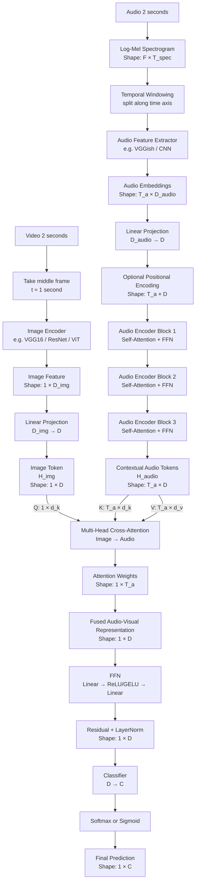
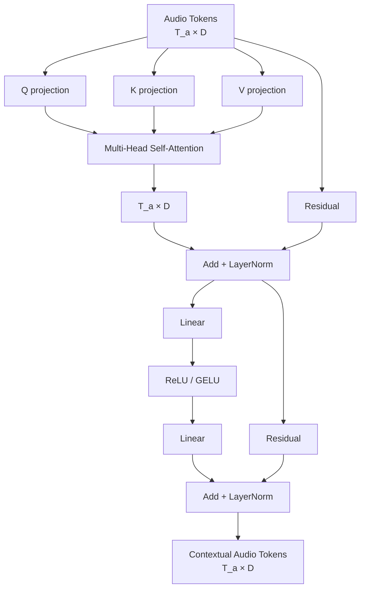
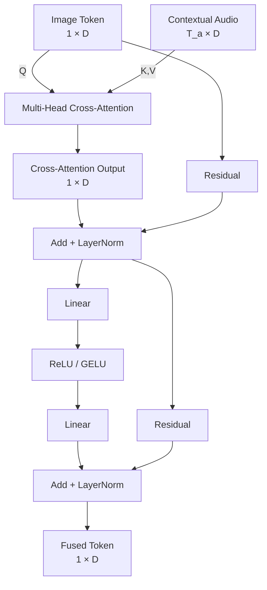
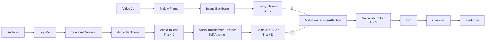

# Đề xuất kiến trúc Multimodal: 1 Middle Video Frame + Full Audio 2 giây

## 1. Mục tiêu

Tài liệu này mô tả một kiến trúc multimodal được **điều chỉnh từ ý tưởng encoder–decoder cross-attention** của paper:

**Audiovisual Transformer Architectures for Large-Scale Classification and Synchronization of Weakly Labeled Audio Events**

Điểm cần phân biệt:

- **Paper gốc** dùng chuỗi audio và chuỗi video frame, sau đó dùng Transformer encoder–decoder để thực hiện cross-modal attention.
- **Đề xuất trong tài liệu này** dành cho trường hợp dữ liệu chỉ có:
  - 1 đoạn audio dài khoảng 2 giây.
  - 1 video tương ứng dài khoảng 2 giây.
  - chỉ lấy **1 frame ở giữa video**.
- Vì chỉ có 1 visual token nhưng có nhiều audio token, kiến trúc được đề xuất theo hướng:

\[
\boxed{
\text{Audio} \rightarrow \text{Encoder},
\qquad
\text{Middle Image} \rightarrow \text{Decoder Query}
}
\]

với:

\[
\boxed{
Q = Image,\quad K = Audio,\quad V = Audio
}
\]

Mục đích là để **1 image token có thể chọn các đoạn audio quan trọng nhất** thay vì để nhiều audio token attention vào đúng 1 image token.

---

# 2. Ý tưởng tổng thể

Pipeline đề xuất:

```text
Audio 2s
   ↓
Log-Mel Spectrogram
   ↓
chia theo trục thời gian thành nhiều audio windows
   ↓
Audio feature extractor
   ↓
T_a audio tokens
   ↓
Audio Transformer Encoder
   ↓
Contextual Audio Tokens
   ↓
             K,V
              ↑
              │
Middle Video Frame
   ↓
Image Encoder
   ↓
1 Image Token
   ↓
Q
   ↓
Image → Audio Cross-Attention
   ↓
1 Multimodal Token
   ↓
FFN
   ↓
Classifier
   ↓
Final Prediction
```

Điểm cốt lõi:

\[
Audio \in \mathbb{R}^{T_a \times D}
\]

\[
Image \in \mathbb{R}^{1 \times D}
\]

Cross-attention:

\[
AttentionMap \in \mathbb{R}^{1 \times T_a}
\]

Nhờ đó image có thể học trọng số cho từng đoạn audio.

---

# 3. Mermaid toàn bộ kiến trúc



---

# 4. Nhánh Audio

## 4.1 Raw audio

Input:

\[
x(t)
\]

với độ dài:

\[
2 \text{ seconds}
\]

Raw waveform chưa phù hợp để đưa trực tiếp vào kiến trúc được mô phỏng theo paper.

---

# 5. Log-Mel Spectrogram

Audio được biến đổi thành Log-Mel Spectrogram:

\[
X_{mel} \in \mathbb{R}^{F \times T_{spec}}
\]

Trong đó:

- \(F\): số Mel frequency bins.
- \(T_{spec}\): số timestep của spectrogram.

Quan trọng:

> Log-Mel **đã có chiều thời gian**.

Ví dụ:

```text
                    TIME
            -------------------->

Frequency   █ █ █ █ █ █ █ █ █ █
    ↑       █ █ █ █ █ █ █ █ █ █
    │       █ █ █ █ █ █ █ █ █ █
    │       █ █ █ █ █ █ █ █ █ █
```

Do đó bước `Temporal Windowing` sau Log-Mel **không tạo chiều thời gian mới**.

Nó chỉ cắt spectrogram thành nhiều đoạn theo chính trục thời gian hiện có.

---

# 6. Temporal Windowing

Giả sử:

\[
X_{mel} \in \mathbb{R}^{F \times T_{spec}}
\]

ta cắt theo time axis:

```text
Log-Mel 2s

0s                                                   2s
|-----------------------------------------------------|

|-------- window 1 --------|
          |-------- window 2 --------|
                    |-------- window 3 --------|
                              ...
```

Mỗi window:

\[
W_i \in \mathbb{R}^{F \times L}
\]

với:

- \(L\): số spectrogram timestep trong một audio window.

Sau đó:

\[
W_i \rightarrow AudioEncoder \rightarrow a_i
\]

với:

\[
a_i \in \mathbb{R}^{D_{audio}}
\]

Stack tất cả token:

\[
A =
[a_1,a_2,\dots,a_{T_a}]
\]

\[
A \in \mathbb{R}^{T_a \times D_{audio}}
\]

---

# 7. Khác biệt giữa thời gian của Log-Mel và thời gian của Transformer

Có hai mức temporal resolution.

## Mức 1 — Spectrogram time

Một window có thể chứa nhiều cột thời gian:

```text
Window 1

Frequency
    ↑
    │ ███████████████████████
    │ ███████████████████████
    │ ███████████████████████
    └────────────────────────→ time
```

## Mức 2 — Transformer token time

Toàn bộ window được nén thành một embedding:

\[
W_1 \rightarrow a_1
\]

\[
W_2 \rightarrow a_2
\]

...

Transformer nhìn sequence:

\[
[a_1,a_2,\dots,a_{T_a}]
\]

Do đó:

\[
T_a
\]

là số **audio tokens**, không phải số cột trong Log-Mel.

---

# 8. Không nên mặc định dùng đúng 960 ms / 960 ms nếu audio chỉ dài 2 giây

Paper gốc sử dụng window và hop khoảng 960 ms.

Nếu áp dụng y nguyên vào audio 2 giây:

\[
T_a \approx 2
\]

thì Cross-Attention chỉ có:

\[
1 \times 2
\]

Ví dụ:

\[
[0.35,\ 0.65]
\]

Điều này vẫn chạy được nhưng temporal resolution thấp.

Với bài toán 2 giây, nên coi `window_size` và `hop_size` là hyperparameter cần thử nghiệm.

Ví dụ:

```text
2-second audio

window 1: |--------|
window 2:     |--------|
window 3:         |--------|
window 4:             |--------|
...
```

Nếu tạo được:

\[
T_a = 6, 8, 10,\dots
\]

thì image query có nhiều audio regions hơn để lựa chọn.

---

# 9. Audio Feature Extractor

Có thể dùng:

- VGGish nếu muốn bám gần paper.
- CNN trên Log-Mel.
- PANNs.
- AST feature extractor.
- một audio backbone khác phù hợp dataset.

Nếu muốn bám sát paper:

\[
W_i \rightarrow VGGish \rightarrow a_i
\]

và:

\[
a_i \in \mathbb{R}^{128}
\]

Nếu dùng backbone khác, chỉ cần đảm bảo cuối cùng nhận sequence:

\[
A \in \mathbb{R}^{T_a \times D_{audio}}
\]

---

# 10. Linear Projection cho Audio

Nếu:

\[
D_{audio} \neq D
\]

thì dùng:

\[
Linear(D_{audio},D)
\]

để tạo:

\[
X_A \in \mathbb{R}^{T_a \times D}
\]

Ví dụ:

\[
D=128
\]

thì:

\[
X_A \in \mathbb{R}^{T_a \times 128}
\]

Mục đích:

1. đưa audio về dimension chung;
2. thích nghi pretrained feature với task;
3. tạo representation thích hợp cho attention.

---

# 11. Positional Encoding cho Audio

Audio token có thứ tự:

\[
a_1,a_2,\dots,a_{T_a}
\]

Self-attention tự thân không encode rõ vị trí.

Có thể dùng:

\[
X_A' = X_A + PE
\]

với:

\[
PE \in \mathbb{R}^{T_a \times D}
\]

Mục đích:

> cho model biết audio token nào đến trước/sau.

Trong paper gốc, positional encoding là optional và kết quả cho audio không phải lúc nào cũng cải thiện.

Vì vậy trong implementation nên để thành một ablation:

```text
use_audio_pe = True / False
```

---

# 12. Audio Transformer Encoder

Audio Encoder có nhiệm vụ:

\[
\boxed{
\text{Audio token} \rightarrow \text{Contextual Audio token}
}
\]

Input:

\[
X_A \in \mathbb{R}^{T_a \times D}
\]

Output:

\[
H_A \in \mathbb{R}^{T_a \times D}
\]

Một audio token sau encoder không còn chỉ biểu diễn window riêng của nó.

Nó đã chứa context từ các audio window khác.

---

# 13. Một Audio Encoder Block



---

# 14. Audio Self-Attention

Self-attention dùng:

\[
Q_A,K_A,V_A
\]

đều từ Audio.

\[
SelfAttn(A)
=
softmax
\left(
\frac{Q_AK_A^T}{\sqrt{d_k}}
\right)V_A
\]

Attention map:

\[
\boxed{
T_a \times T_a
}
\]

Ví dụ:

```text
               Audio keys

             a1 a2 a3 a4 a5
Audio q a1   █  .  .  .  .
        a2   .  █  █  .  .
        a3   .  █  █  █  .
        ...
```

Mục đích:

> cho từng audio region sử dụng context từ các region khác.

---

# 15. Vì sao Audio Encoder quan trọng?

Ví dụ audio:

```text
a1 = background
a2 = weak engine
a3 = strong engine
a4 = horn
a5 = background
```

Nếu xử lý độc lập:

\[
a_4
\]

chỉ biểu diễn tiếng còi.

Sau self-attention:

\[
h_4
\]

có thể chứa:

```text
horn
+
engine context
+
surrounding acoustic information
```

Điều này tạo Key/Value tốt hơn cho image query.

---

# 16. Số Encoder Blocks

Có thể bắt đầu với:

\[
N_{enc}=1
\]

sau đó thử:

\[
1,\ 2,\ 3
\]

Paper gốc dùng 3 blocks, nhưng với dữ liệu 2 giây và số token nhỏ, không nên mặc định 3 là tối ưu.

Recommended ablation:

```text
num_audio_encoder_layers ∈ {1, 2, 3}
```

---

# 17. Nhánh Image

Video dài 2 giây.

Chỉ lấy:

\[
\boxed{\text{middle frame}}
\]

xấp xỉ:

\[
t = 1 \text{ second}
\]

```text
Video

0s ---------------- 1s ---------------- 2s
                     ↑
                middle frame
```

Image này đóng vai trò:

\[
\boxed{\text{global visual context}}
\]

cho toàn bộ audio 2 giây.

---

# 18. Image Encoder

Có thể dùng:

- VGG16 nếu muốn gần paper.
- ResNet.
- EfficientNet.
- ViT.
- CLIP image encoder.
- backbone hiện tại của project.

Output:

\[
I \in \mathbb{R}^{1 \times D_{img}}
\]

Ví dụ VGG16 theo paper:

\[
D_{img}=4096
\]

---

# 19. Linear Projection cho Image

Image feature được đưa về cùng dimension với Audio:

\[
Linear(D_{img},D)
\]

Ví dụ:

\[
4096 \rightarrow 128
\]

Output:

\[
H_I \in \mathbb{R}^{1 \times 128}
\]

Đây là **1 visual token duy nhất**.

---

# 20. Tại sao không dùng Image Self-Attention?

Vì:

\[
T_{image}=1
\]

Self-attention map sẽ là:

\[
1 \times 1
\]

và với softmax:

\[
softmax([x]) = [1]
\]

Do đó single-token image self-attention gần như không tạo interaction temporal/token đáng kể.

Vì vậy trong kiến trúc tối giản:

> không cần Image Transformer Encoder riêng nếu chỉ có đúng 1 image token.

Image Encoder CNN/ViT + Linear Projection là đủ để tạo query.

---

# 21. Cross-Attention: trung tâm của kiến trúc

Ta dùng:

\[
Q = Image
\]

\[
K = Audio
\]

\[
V = Audio
\]

Shape:

\[
Q_I \in \mathbb{R}^{1 \times d_k}
\]

\[
K_A \in \mathbb{R}^{T_a \times d_k}
\]

\[
V_A \in \mathbb{R}^{T_a \times d_v}
\]

Attention:

\[
CrossAttn(I,A)
=
softmax
\left(
\frac{Q_IK_A^T}{\sqrt{d_k}}
\right)V_A
\]

---

# 22. Shape của Cross-Attention

Ta có:

\[
Q_IK_A^T
\]

với:

\[
(1 \times d_k)(d_k \times T_a)
\]

nên:

\[
\boxed{
AttentionMap \in \mathbb{R}^{1 \times T_a}
}
\]

Ví dụ:

\[
T_a=8
\]

thì:

\[
Attention =
[0.03,\ 0.07,\ 0.10,\ 0.50,\ 0.20,\ 0.05,\ 0.03,\ 0.02]
\]

Có thể hiểu:

```text
Image Query

             AUDIO TOKENS
          a1 a2 a3 a4 a5 a6 a7 a8
           .  .  . ███ ██  .  .  .
                    ↑
            audio region quan trọng
```

---

# 23. Ý nghĩa của Image → Audio Attention

Giả sử image giữa video chứa:

```text
motorcycle
```

Audio 2 giây chứa:

```text
a1 = background
a2 = weak noise
a3 = weak engine
a4 = strong motorcycle engine
a5 = motorcycle engine
a6 = background
...
```

Image query có thể học:

\[
Attention(a_4) > Attention(a_1)
\]

và tạo:

\[
z
=
\sum_{t=1}^{T_a}\alpha_tV_t
\]

Nếu:

\[
\alpha_4=0.5
\]

thì audio token 4 đóng góp mạnh nhất vào fused feature.

---

# 24. Tại sao chọn Image làm Query?

Nếu làm ngược:

\[
Q=Audio,\quad K,V=Image
\]

thì attention map:

\[
T_a \times 1
\]

Vì chỉ có 1 image key, softmax trên key dimension sẽ cho:

\[
[1]
\]

với mọi audio query.

Tức mọi audio timestep đều nhận cùng image token.

Model vẫn có thể dùng image như global context, nhưng attention không có khả năng **chọn giữa nhiều visual tokens**.

Trong trường hợp:

\[
1\ image + many\ audio\ tokens
\]

hướng:

\[
\boxed{
Image \rightarrow Audio
}
\]

hợp lý hơn nếu mục tiêu là tận dụng selective attention.

---

# 25. Multi-Head Cross-Attention

Có thể dùng:

\[
h
\]

attention heads.

Mỗi head:

\[
head_i =
Attention(
QW_i^Q,
KW_i^K,
VW_i^V
)
\]

Sau đó:

\[
MultiHead =
Concat(head_1,\dots,head_h)W^O
\]

Mục đích:

> cho model học nhiều kiểu tương quan image–audio song song.

Ví dụ trực giác:

- head 1 có thể tập trung vào engine sound;
- head 2 có thể tập trung vào transient sound;
- head 3 có thể tập trung vào background context.

Đây chỉ là trực giác; không nên mặc định mỗi head học đúng ý nghĩa cố định như trên.

---

# 26. Fused Representation

Sau cross-attention:

\[
Z_{AV} \in \mathbb{R}^{1 \times D}
\]

Đây là:

\[
\boxed{
\text{Image-conditioned Audio Summary}
}
\]

Nó có thể hiểu là:

> một vector tổng hợp audio, nhưng các audio regions đã được weighting dựa trên visual query.

---

# 27. FFN sau Cross-Attention

Cross-attention làm nhiệm vụ:

\[
\boxed{\text{select / aggregate}}
\]

FFN làm nhiệm vụ:

\[
\boxed{\text{transform / refine}}
\]

Ví dụ:

\[
Z_{AV}
\rightarrow
Linear
\rightarrow
Activation
\rightarrow
Linear
\]

Shape:

\[
1 \times D
\rightarrow
1 \times D
\]

FFN giúp tạo nonlinear transformation của multimodal representation.

---

# 28. Residual Connection

Có thể dùng:

\[
H' = LayerNorm(H_I + CrossAttn(H_I,H_A))
\]

sau đó:

\[
H'' = LayerNorm(H' + FFN(H'))
\]

Mục đích:

- giữ visual query gốc;
- cộng thêm audio evidence;
- giúp gradient flow ổn định hơn.

Có thể hiểu:

```text
Image information
      +
Relevant Audio information
      ↓
Multimodal representation
```

---

# 29. Một Cross-Modal Decoder Block đề xuất



---

# 30. Có cần Decoder ×3 không?

Không nhất thiết.

Với dữ liệu:

\[
1\ image\ token
\]

và audio chỉ dài 2 giây, nên bắt đầu với:

\[
\boxed{1\ Cross\ Attention\ Block}
\]

trước.

Sau đó ablation:

```text
num_cross_blocks ∈ {1, 2, 3}
```

Nếu dùng nhiều block:

\[
I^{(1)}
=
Decoder_1(I^{(0)},A)
\]

\[
I^{(2)}
=
Decoder_2(I^{(1)},A)
\]

\[
I^{(3)}
=
Decoder_3(I^{(2)},A)
\]

Mỗi block có thể query lại Audio bằng representation đã được cập nhật.

---

# 31. Classifier

Sau fusion:

\[
H_{AV}\in\mathbb{R}^{1\times D}
\]

Classifier:

\[
Linear(D,C)
\]

Output logits:

\[
Z\in\mathbb{R}^{1\times C}
\]

---

# 32. Softmax hay Sigmoid?

## Single-label classification

Nếu mỗi sample chỉ có đúng một class:

\[
\boxed{Softmax}
\]

Loss:

\[
CrossEntropyLoss
\]

## Multi-label classification

Nếu một sample có thể có nhiều class:

\[
\boxed{Sigmoid}
\]

Loss:

\[
BCEWithLogitsLoss
\]

Cần chọn theo bài toán thực tế, không theo paper một cách máy móc.

---

# 33. Không cần Temporal Pooling sau Cross-Attention

Paper gốc cần:

\[
T \times C \rightarrow C
\]

vì Decoder output vẫn là một sequence.

Trong kiến trúc này:

\[
Image\ Query = 1\ token
\]

nên sau cross-attention:

\[
1 \times D
\]

Classifier:

\[
1 \times D
\rightarrow
1 \times C
\]

Do đó:

\[
\boxed{\text{không cần Mean/Max Pooling cuối mạng}}
\]

Cross-attention đã thực hiện một dạng **attention-weighted temporal aggregation trên Audio**.

---

# 34. Shape tổng hợp

Giả sử:

\[
D=128
\]

và audio tạo:

\[
T_a=8
\]

thì pipeline:

```text
AUDIO

Raw Audio 2s
      ↓
Log-Mel
      ↓
8 temporal windows
      ↓
Audio Backbone
      ↓
8 × 128
      ↓
Audio Self-Attention
      ↓
8 × 128
      ↓
      K,V
       │
       │
IMAGE  │
       │
Middle Frame
      ↓
Image Backbone
      ↓
1 × D_img
      ↓
Projection
      ↓
1 × 128
      ↓
      Q
       │
       ▼

Cross-Attention

Q: 1 × d_k
K: 8 × d_k
V: 8 × d_v

Attention Map:
1 × 8

      ↓

Fused Feature:
1 × 128

      ↓

FFN:
1 × 128

      ↓

Classifier:
1 × C
```

---

# 35. Mermaid rút gọn cho implementation



---

# 36. Recommended first baseline

Để tránh làm model quá phức tạp ngay từ đầu:

```text
Audio:
LogMel
→ Audio Backbone
→ Projection
→ 1 Audio Transformer Encoder Block

Image:
Middle Frame
→ Image Backbone
→ Projection

Fusion:
1 Multi-Head Cross-Attention Block

Head:
FFN
→ Classifier
```

Tức:

\[
N_{audio-encoder}=1
\]

\[
N_{cross-attention}=1
\]

Sau khi có baseline mới thử tăng depth.

---

# 37. Ablation experiments nên chạy

## Experiment A — Fusion baseline

```text
Image + Audio Concatenation
```

Mục đích:

> xác định cross-attention có thực sự tốt hơn concat không.

## Experiment B — Proposed Cross-Attention

```text
Q = Image
K,V = Audio
```

Đây là architecture chính.

## Experiment C — Reverse Cross-Attention

```text
Q = Audio
K,V = Image
```

Mục đích:

> kiểm chứng giả thuyết rằng hướng Image→Audio phù hợp hơn khi chỉ có một visual token.

## Experiment D — Number of Audio Tokens

Ví dụ:

```text
T_a = 2
T_a = 4
T_a = 8
T_a = 16
```

Thông qua thay đổi:

- window size;
- hop size;
- backbone temporal stride.

Đây là ablation rất quan trọng.

## Experiment E — Audio Self-Attention

So sánh:

```text
Audio Backbone
→ directly Cross-Attention
```

với:

```text
Audio Backbone
→ Audio Self-Attention
→ Cross-Attention
```

Để kiểm tra contextual audio modeling có đóng góp hay không.

## Experiment F — Number of Cross-Attention Blocks

```text
1 block
2 blocks
3 blocks
```

## Experiment G — Positional Encoding

```text
Audio PE ON
Audio PE OFF
```

---

# 38. Model config gợi ý

```yaml
audio:
  duration: 2.0
  feature: log_mel
  backbone: vggish
  embedding_dim: 128

  window_size: tune
  hop_size: tune

  transformer:
    d_model: 128
    num_layers: 1
    num_heads: 4
    positional_encoding: true

image:
  frame_selection: middle
  backbone: vgg16
  pretrained: true
  projection_dim: 128

fusion:
  type: image_to_audio_cross_attention
  query: image
  key: audio
  value: audio
  d_model: 128
  num_heads: 4
  num_layers: 1

classifier:
  input_dim: 128
  num_classes: C
```

Lưu ý:

- `num_heads=4` ở đây là **gợi ý cho implementation mới**, không phải giá trị được paper bắt buộc.
- Với `D=128`, 4 heads thuận tiện vì:

\[
128 / 4 = 32
\]

mỗi head.

---

# 39. Pseudocode forward pass

```python
def forward(audio, video):
    # 1. AUDIO
    mel = log_mel(audio)
    windows = temporal_windowing(mel)
    audio_tokens = audio_backbone(windows)
    audio_tokens = audio_projection(audio_tokens)
    audio_tokens = add_positional_encoding(audio_tokens)
    audio_context = audio_transformer_encoder(audio_tokens)
    # [B, T_a, D]

    # 2. IMAGE
    middle_frame = select_middle_frame(video)
    image_feature = image_backbone(middle_frame)
    image_token = image_projection(image_feature)
    image_token = image_token.unsqueeze(1)
    # [B, 1, D]

    # 3. CROSS ATTENTION
    fused, attention_weights = cross_attention(
        query=image_token,
        key=audio_context,
        value=audio_context
    )
    # fused: [B, 1, D]
    # attention_weights: [B, heads, 1, T_a]

    # 4. CLASSIFIER
    fused = ffn(fused)
    fused = fused.squeeze(1)
    logits = classifier(fused)

    return logits, attention_weights
```

---

# 40. Attention visualization

Một lợi thế của architecture:

\[
AttentionWeights
\]

có thể visualize.

Nếu:

\[
T_a=8
\]

```text
Audio timeline

0s                                           2s
|---------------------------------------------|

a1  a2  a3  a4  a5  a6  a7  a8

.   .   ▂   █   ▆   .   .   .
            ↑
       highest attention
```

Điều này giúp phân tích:

> Middle image đang sử dụng đoạn audio nào để classification?

---

# 41. Expected benefits

## 1. Tận dụng full audio

Không collapse toàn bộ 2 giây thành một vector duy nhất.

Giữ:

\[
T_a
\]

temporal audio tokens.

## 2. Dùng middle frame như global semantic cue

Middle frame cung cấp:

- object;
- scene;
- appearance;
- context.

## 3. Dynamic fusion

Không dùng fixed concatenation.

Model học:

\[
\alpha_t
\]

cho từng audio token.

## 4. Interpretability

Attention map:

\[
1 \times T_a
\]

có thể visualize trực tiếp.

## 5. Phù hợp với dữ liệu bất đối xứng

Input có:

\[
1\ image
\]

nhưng:

\[
T_a\ audio\ tokens
\]

Architecture không ép hai modality phải có cùng số timestep.

---

# 42. Limitations

## 1. Middle frame có thể không đại diện toàn video

Nếu event chỉ xuất hiện ở đầu/cuối video, middle frame có thể bỏ lỡ.

## 2. Không học visual temporal dynamics

Vì:

\[
T_v=1
\]

model không biết:

- motion;
- object trajectory;
- temporal visual change.

## 3. Cross-attention chỉ có một visual query

Ta học:

\[
1 \times T_a
\]

chứ không có full alignment:

\[
T_v \times T_a
\]

như audiovisual sequence models.

## 4. Attention không đồng nghĩa với causal explanation

Attention weights hữu ích để phân tích model nhưng không nên mặc định chúng là bằng chứng nhân quả.

---

# 43. Nếu middle frame không đủ

Có thể mở rộng sau này:

## Option 1 — 3 frames

```text
start
middle
end
```

Khi đó:

\[
T_v=3
\]

và cross-attention:

\[
3 \times T_a
\]

## Option 2 — K uniformly sampled frames

\[
T_v=K
\]

sẽ gần với paper gốc hơn.

## Option 3 — Video encoder

Nếu dùng nhiều frame:

```text
Frames
→ CNN / ViT
→ Video Self-Attention
→ Cross-Attention with Audio
```

---

# 44. Tên architecture đề xuất

Tên mô tả ngắn:

**Middle-Frame Image-to-Audio Cross-Attention Network**

Tên code:

```text
MidFrameAudioCrossAttention
```

Tên branch Git:

```text
exp/midframe-to-audio-cross-attn
```

---

# 45. Công thức cuối cùng

Audio feature extraction:

\[
A = f_{audio}(x_{audio})
\]

Projection:

\[
A' = AW_A
\]

Audio contextualization:

\[
H_A = TransformerEncoder(A')
\]

Image extraction:

\[
I = f_{image}(x_{midframe})
\]

Projection:

\[
H_I = IW_I
\]

Cross-modal fusion:

\[
Z =
MultiHeadAttention(
Q=H_I,
K=H_A,
V=H_A
)
\]

Residual + FFN:

\[
H_{AV}
=
FFN(
LayerNorm(H_I+Z)
)
\]

Classification:

\[
\hat y =
Classifier(H_{AV})
\]

Toàn bộ architecture:

\[
\boxed{
\begin{aligned}
Audio
&\rightarrow
LogMel
\rightarrow
AudioTokens
\rightarrow
AudioSelfAttention
\\
MiddleFrame
&\rightarrow
ImageEncoder
\rightarrow
ImageToken
\\
ImageToken
&\xrightarrow{Q}
CrossAttention
\xleftarrow{K,V}
AudioTokens
\\
&\rightarrow
FFN
\rightarrow
Classifier
\rightarrow
Prediction
\end{aligned}
}
\]

---

# 46. Kết luận

Với dữ liệu:

\[
\boxed{
1\ middle\ frame + 2s\ full\ audio
}
\]

kiến trúc đề xuất là:

\[
\boxed{
Audio\ Encoder
+
Image\rightarrow Audio\ CrossAttention
}
\]

thay vì:

\[
Audio\rightarrow Image
\]

Lý do chính:

\[
Q_{image}K_{audio}^T
\rightarrow
1\times T_a
\]

cho phép middle image **lựa chọn động các đoạn audio quan trọng**.

Trong khi nếu:

\[
Q_{audio}K_{image}^T
\]

thì:

\[
T_a\times1
\]

và với softmax trên chỉ một visual key, attention gần như không còn khả năng lựa chọn.

Vì vậy với thiết kế dữ liệu bất đối xứng này:

\[
\boxed{
Q=Image,\qquad K=Audio,\qquad V=Audio
}
\]

là baseline cross-attention hợp lý nhất để thử đầu tiên.
